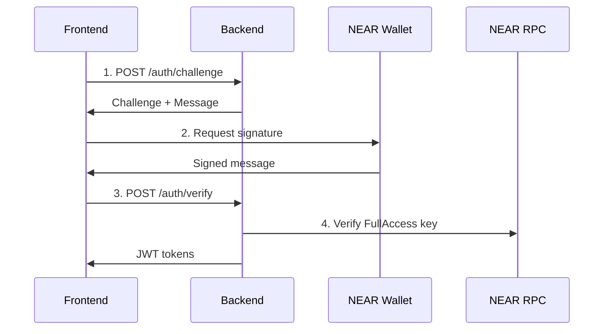

# 🔐 NEAR Authentication API Rehberi

Bu rehber, MintroAI Backend'inde NEAR Protocol authentication servislerinin nasıl kullanılacağını detaylı olarak açıklar.

## 📋 İçindekiler

1. [Genel Bakış](#genel-bakış)
2. [Authentication Flow](#authentication-flow)
3. [API Endpoints](#api-endpoints)
4. [Signature Formatları](#signature-formatları)
5. [Frontend Entegrasyonu](#frontend-entegrasyonu)
6. [Güvenlik Özellikleri](#güvenlik-özellikleri)
7. [Hata Yönetimi](#hata-yönetimi)
8. [Test Örnekleri](#test-örnekleri)

---

## 🎯 Genel Bakış

NEAR Authentication sistemi iki farklı signature format'ını destekler:

- **Legacy Format**: Basit string signature (test/development için)
- **NEAR signMessage Standard**: NEAR wallet'ların kullandığı resmi format (production için)

### Desteklenen Özellikler

✅ **NEAR Account Types**
- Implicit accounts (64 hex chars)
- Named accounts (user.near)
- Sub-accounts (sub.user.near)

✅ **Security Features**
- FullAccess key verification
- Challenge expiration (5 dakika)
- Rate limiting (30 req/min per IP)
- Borsh serialization
- Ed25519 signature verification

---

## 🔄 Authentication Flow



### Adım Adım Süreç

1. **Challenge Request**: Frontend, wallet address ile challenge ister
2. **Message Signing**: Wallet, challenge message'ını imzalar
3. **Signature Verification**: Backend, imzayı ve key permissions'ı doğrular
4. **Token Generation**: Başarılı doğrulama sonrası JWT tokens üretilir

---

## 🚀 API Endpoints

### 1. Challenge Creation

**Endpoint:** `POST /api/v1/auth/challenge`

**Request:**
```json
{
  "wallet_address": "user.near",
  "protocol": "near"
}
```

**Response:**
```json
{
  "nonce": "0xa3c6cf2795979c4bd25bb41537821618135de9bc34b0167b58fec199152a5205",
  "message": "Login to MintroAI\n\nChallenge: a3c6cf2795979c4bd25bb41537821618135de9bc34b0167b58fec199152a5205\nTimestamp: 2025-01-10T12:00:00Z",
  "expires_in": 299,
  "protocol": "near"
}
```

### 2. Signature Verification

**Endpoint:** `POST /api/v1/auth/verify`

#### 2.1 NEAR signMessage Format (Önerilen)

**Request:**
```json
{
  "wallet_address": "user.near",
  "protocol": "near",
  "nonce": "0xa3c6cf2795979c4bd25bb41537821618135de9bc34b0167b58fec199152a5205",
  "recipient": "http://localhost:3000",
  "signature": {
    "accountId": "user.near",
    "publicKey": "ed25519:AtH7GEjv2qm...",
    "signature": "IfModLa3g3czlyP..."
  }
}
```

#### 2.2 Legacy Format

**Request:**
```json
{
  "wallet_address": "user.near",
  "protocol": "near",
  "nonce": "0xa3c6cf2795979c4bd25bb41537821618135de9bc34b0167b58fec199152a5205",
  "signature": "4V7tSvtQeEQ7aVnKfE59jqLj2CfvrFh7MSDZDrvSefqv...",
  "public_key": "ed25519:Fmt5MHGpnjVDRpqRr25XpdrN8TNd9jUFZXa65pB9uptP"
}
```

**Response (Her iki format için):**
```json
{
  "access_token": "eyJhbGciOiJIUzI1NiIs...",
  "refresh_token": "eyJhbGciOiJIUzI1NiIs...",
  "token_type": "bearer",
  "expires_in": 1800,
  "wallet_address": "user.near",
  "protocol": "near"
}
```

---

## 📝 Signature Formatları

### NEAR signMessage Standard

NEAR wallet'lar `signMessage` fonksiyonu kullanırken özel bir payload oluşturur:

```javascript
// Frontend'de NEAR Wallet ile imzalama
const signedMessage = await nearWallet.signMessage({
  message: "Login to MintroAI",
  recipient: "http://localhost:3000",
  nonce: Buffer.from(nonce.slice(2), 'hex'), // 32 byte buffer
  callbackUrl: undefined
});

// Sonuç:
{
  "accountId": "user.near",
  "publicKey": "ed25519:AtH7GEjv2qm...",
  "signature": "IfModLa3g3czlyP..." // Base64
}
```

### Backend Verification Process

1. **Payload Creation**: 
   ```json
   {
     "tag": 2147484061,
     "message": "Login to MintroAI",
     "nonce": "32_byte_buffer",
     "recipient": "http://localhost:3000",
     "callbackUrl": null
   }
   ```

2. **Borsh Serialization**: Payload borsh ile serialize edilir
3. **SHA256 Hash**: Serialize edilen data hash'lenir
4. **Ed25519 Verification**: Hash, public key ile doğrulanır
5. **FullAccess Check**: Public key'in FullAccess yetkisi kontrol edilir

---

## 💻 Frontend Entegrasyonu

### React/Next.js Örneği

```javascript
import { connect, keyStores, WalletConnection } from 'near-api-js';

class NEARAuth {
  constructor() {
    this.near = null;
    this.wallet = null;
  }

  async init() {
    // NEAR connection
    this.near = await connect({
      networkId: 'testnet',
      keyStore: new keyStores.BrowserLocalStorageKeyStore(),
      nodeUrl: 'https://rpc.testnet.near.org',
      walletUrl: 'https://wallet.testnet.near.org',
    });

    this.wallet = new WalletConnection(this.near, 'mintroai');
  }

  async authenticate() {
    try {
      // 1. Get challenge
      const challengeResponse = await fetch(`${API_BASE}/auth/challenge`, {
        method: 'POST',
        headers: { 'Content-Type': 'application/json' },
        body: JSON.stringify({
          wallet_address: this.wallet.getAccountId(),
          protocol: 'near'
        })
      });

      const challenge = await challengeResponse.json();

      // 2. Sign message with NEAR wallet
      const signedMessage = await this.wallet.account().connection.signer.signMessage(
        challenge.message,
        this.wallet.getAccountId(),
        'mintroai'
      );

      // 3. Verify signature
      const verifyResponse = await fetch(`${API_BASE}/auth/verify`, {
        method: 'POST',
        headers: { 'Content-Type': 'application/json' },
        body: JSON.stringify({
          wallet_address: this.wallet.getAccountId(),
          protocol: 'near',
          nonce: challenge.nonce,
          recipient: window.location.origin,
          signature: {
            accountId: signedMessage.accountId,
            publicKey: signedMessage.publicKey,
            signature: signedMessage.signature
          }
        })
      });

      const tokens = await verifyResponse.json();
      
      // 4. Store tokens
      localStorage.setItem('access_token', tokens.access_token);
      localStorage.setItem('refresh_token', tokens.refresh_token);

      return tokens;

    } catch (error) {
      console.error('NEAR authentication failed:', error);
      throw error;
    }
  }
}
```

### Vanilla JavaScript Örneği

```html
<!DOCTYPE html>
<html>
<head>
    <title>NEAR Auth Test</title>
    <script src="https://cdn.jsdelivr.net/npm/near-api-js@0.44.2/dist/near-api-js.min.js"></script>
</head>
<body>
    <button onclick="authenticateWithNEAR()">Connect NEAR Wallet</button>

    <script>
        const API_BASE = 'http://localhost:8000/api/v1';

        async function authenticateWithNEAR() {
            try {
                // Initialize NEAR
                const near = await nearApi.connect({
                    networkId: 'testnet',
                    keyStore: new nearApi.keyStores.BrowserLocalStorageKeyStore(),
                    nodeUrl: 'https://rpc.testnet.near.org',
                    walletUrl: 'https://wallet.testnet.near.org',
                });

                const wallet = new nearApi.WalletConnection(near, 'mintroai');

                if (!wallet.isSignedIn()) {
                    wallet.requestSignIn();
                    return;
                }

                const accountId = wallet.getAccountId();

                // 1. Get challenge
                const challengeResponse = await fetch(`${API_BASE}/auth/challenge`, {
                    method: 'POST',
                    headers: { 'Content-Type': 'application/json' },
                    body: JSON.stringify({
                        wallet_address: accountId,
                        protocol: 'near'
                    })
                });

                const challenge = await challengeResponse.json();
                console.log('Challenge:', challenge);

                // 2. Sign with NEAR wallet (simplified for demo)
                // In real implementation, use wallet.signMessage()
                
            } catch (error) {
                console.error('Error:', error);
            }
        }
    </script>
</body>
</html>
```

---

## 🛡️ Güvenlik Özellikleri

### 1. FullAccess Key Verification

Backend, her signature verification'da public key'in FullAccess yetkisine sahip olduğunu kontrol eder:

```python
# Backend'de otomatik kontrol
async def _verify_full_access_key(self, account_id: str, public_key: str) -> bool:
    # NEAR RPC call to check key permissions
    access_keys = await self.get_access_keys(account_id)
    
    for key in access_keys:
        if key.public_key == public_key:
            return key.permission == "FullAccess"
    
    return False
```

### 2. Challenge Expiration

- Challenges 5 dakika sonra expire olur
- Expired challenge'lar otomatik olarak reddedilir
- Her wallet address için tek aktif challenge

### 3. Rate Limiting

- IP başına 30 request/dakika
- Aşım durumunda 429 Too Many Requests
- Otomatik IP blocking (opsiyonel)

### 4. Address Validation

```python
# Desteklenen NEAR address formatları
VALID_FORMATS = [
    "user.near",           # Named account
    "sub.user.near",       # Sub-account  
    "a1b2c3d4e5f6...",     # Implicit account (64 hex)
]
```

---

## ⚠️ Hata Yönetimi

### Yaygın Hatalar ve Çözümleri

#### 1. Invalid Signature
```json
{
  "detail": {
    "error": {
      "code": "INVALID_SIGNATURE",
      "message": "Invalid signature: Public key does not have FullAccess permission"
    }
  }
}
```
**Çözüm**: Wallet'ın FullAccess key'i kullandığından emin olun.

#### 2. No Active Challenge
```json
{
  "detail": {
    "error": {
      "code": "INVALID_SIGNATURE", 
      "message": "Invalid signature: No active challenge found"
    }
  }
}
```
**Çözüm**: Önce `/auth/challenge` endpoint'ini çağırın.

#### 3. Rate Limit Exceeded
```json
{
  "detail": "Rate limit exceeded. Try again later."
}
```
**Çözüm**: 1 dakika bekleyip tekrar deneyin.

#### 4. Invalid Address Format
```json
{
  "detail": {
    "error": {
      "code": "INVALID_FORMAT",
      "message": "Invalid NEAR address format"
    }
  }
}
```
**Çözüm**: Geçerli NEAR address formatı kullanın.

---

## 🧪 Test Örnekleri

### cURL ile Test

```bash
# 1. Challenge oluştur
curl -X POST "http://localhost:8000/api/v1/auth/challenge" \
  -H "Content-Type: application/json" \
  -d '{
    "wallet_address": "test.near",
    "protocol": "near"
  }'

# 2. Legacy format ile verify
curl -X POST "http://localhost:8000/api/v1/auth/verify" \
  -H "Content-Type: application/json" \
  -d '{
    "wallet_address": "test.near",
    "protocol": "near",
    "nonce": "0x...",
    "signature": "base58_signature",
    "public_key": "ed25519:..."
  }'

# 3. NEAR signMessage format ile verify
curl -X POST "http://localhost:8000/api/v1/auth/verify" \
  -H "Content-Type: application/json" \
  -d '{
    "wallet_address": "test.near",
    "protocol": "near", 
    "nonce": "0x...",
    "recipient": "http://localhost:3000",
    "signature": {
      "accountId": "test.near",
      "publicKey": "ed25519:...",
      "signature": "base64_signature"
    }
  }'
```

### Python Test Script

```python
import requests
import json
from src.core.service.auth.utils.crypto import sign_message_near_standard

# Test configuration
API_BASE = "http://localhost:8000/api/v1"
WALLET_ADDRESS = "test.near"

def test_near_auth():
    # 1. Get challenge
    challenge_response = requests.post(f"{API_BASE}/auth/challenge", json={
        "wallet_address": WALLET_ADDRESS,
        "protocol": "near"
    })
    
    challenge = challenge_response.json()
    print("Challenge:", json.dumps(challenge, indent=2))
    
    # 2. Sign message (test signature)
    signature_data = sign_message_near_standard(
        message=challenge["message"],
        nonce=challenge["nonce"], 
        recipient="http://localhost:3000",
        private_key_b58="test_private_key",
        account_id=WALLET_ADDRESS
    )
    
    # 3. Verify signature
    verify_response = requests.post(f"{API_BASE}/auth/verify", json={
        "wallet_address": WALLET_ADDRESS,
        "protocol": "near",
        "nonce": challenge["nonce"],
        "recipient": "http://localhost:3000", 
        "signature": signature_data
    })
    
    result = verify_response.json()
    print("Verification:", json.dumps(result, indent=2))

if __name__ == "__main__":
    test_near_auth()
```

---

## 📚 Ek Kaynaklar

### NEAR Protocol Dokümantasyonu
- [NEAR Wallet Integration](https://docs.near.org/tools/wallet-selector)
- [NEAR JavaScript API](https://docs.near.org/tools/near-api-js/quick-reference)
- [NEAR Authentication](https://docs.near.org/concepts/basics/accounts/access-keys)

### MintroAI Backend
- [API Documentation](http://localhost:8000/) (Server çalışırken)
- [Health Check](http://localhost:8000/api/v1/health)
- [OpenAPI Schema](http://localhost:8000/redoc)

---

## 🔧 Troubleshooting

### Development Environment

```bash
# Backend'i başlat
cd mintroai-backend
source venv/bin/activate
python -m uvicorn main:app --host 0.0.0.0 --port 8000 --reload

# Health check
curl http://localhost:8000/api/v1/health

# NEAR protocol status
curl http://localhost:8000/api/v1/health | jq '.protocols.near'
```

### Production Deployment

1. **Environment Variables**:
   ```bash
   NEAR_NETWORK_ID=mainnet
   NEAR_RPC_URLS=https://rpc.mainnet.near.org,https://rpc.fastnear.com
   ALLOWED_ORIGINS=https://yourdomain.com
   ```

2. **CORS Configuration**: Frontend domain'ini `ALLOWED_ORIGINS`'e ekleyin

3. **Rate Limiting**: Production'da rate limit'leri ayarlayın

4. **Monitoring**: Health endpoint'ini monitoring sistemine ekleyin

---

## 📞 Destek

Herhangi bir sorun yaşarsanız:

1. **Logs**: Backend logs'ları kontrol edin
2. **Health Check**: `/api/v1/health` endpoint'ini kontrol edin  
3. **Rate Limits**: IP rate limit'lerini kontrol edin
4. **NEAR RPC**: NEAR network durumunu kontrol edin

**İletişim**: support@mintroai.com

---

*Bu rehber MintroAI Backend v1.0.0 için hazırlanmıştır.*

